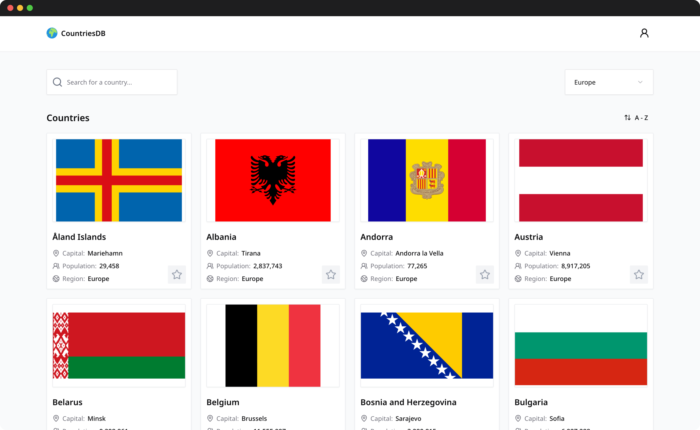

# CountriesDB

A modern, searchable and filterable database of countries around the world.

## Features

- Browse all countries
- Search countries and filter by region
- Sort countries alphabetically
- View detailed info for each country, including bordering countries
- Favourite countries (requires sign-in)
- User authentication (email/password & Google)
- Responsive, mobile-friendly design

## Getting Started

### Installation

```bash
git clone https://github.com/markslorach/countries-db.git
cd countries-db
pnpm install
```

### Environment Variables

Before running the project, create a `.env` file in the root directory and add the following keys:

> **Note:** You must supply your own values for each key below.

```env
DATABASE_URL=your_postgresql_connection_string
GOOGLE_CLIENT_ID=your_google_client_id
GOOGLE_CLIENT_SECRET=your_google_client_secret
NEXT_PUBLIC_BETTER_AUTH_URL=your_better_auth_url
TEST_USER_EMAIL=your_test_user_email # for test/demo accounts
```

- `DATABASE_URL`: PostgreSQL connection string for Prisma
- `GOOGLE_CLIENT_ID` and `GOOGLE_CLIENT_SECRET`: for Google authentication
- `NEXT_PUBLIC_BETTER_AUTH_URL`: Better Auth service URL
- `TEST_USER_EMAIL`: for test/demo user logic

### Development

```bash
pnpm dev
```

### Build

```bash
pnpm build
```

### Preview

```bash
pnpm start
```

## Tech Stack

- Next.js 15 (React 19)
- TypeScript
- Tailwind CSS
- shadcn/ui
- Better Auth
- Prisma (PostgreSQL)

## Acknowledgements
- [@juliencrn/usehooks-ts](https://github.com/juliencrn/usehooks-ts)

> Inspired by the [Frontend Mentor REST Countries API challenge](https://www.frontendmentor.io/challenges/rest-countries-api-with-color-theme-switcher-5cacc469fec04111f7b848ca) - this project has been expanded with extra features and improvements.
